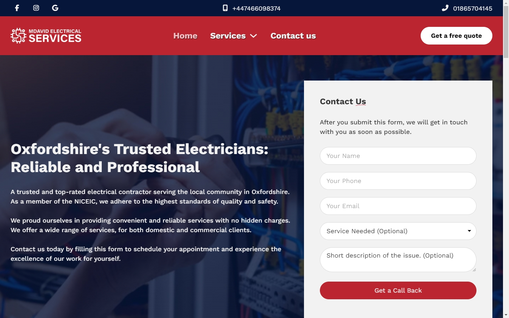
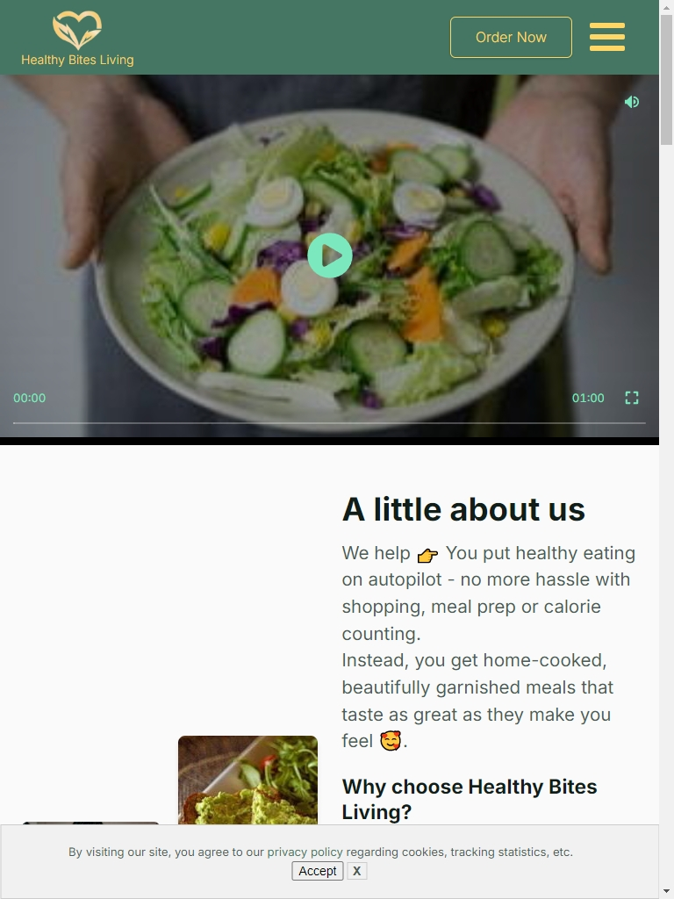
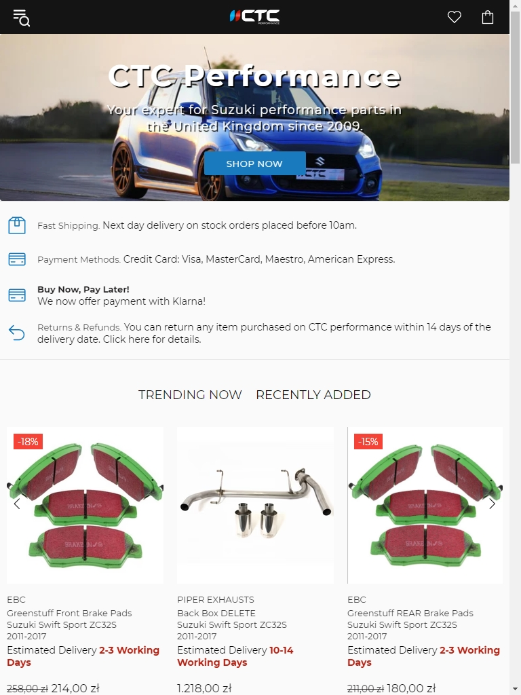
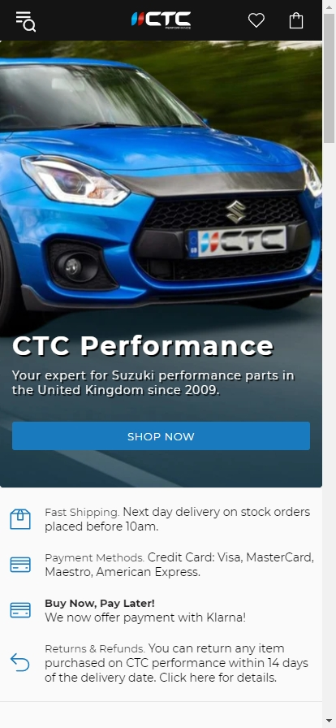
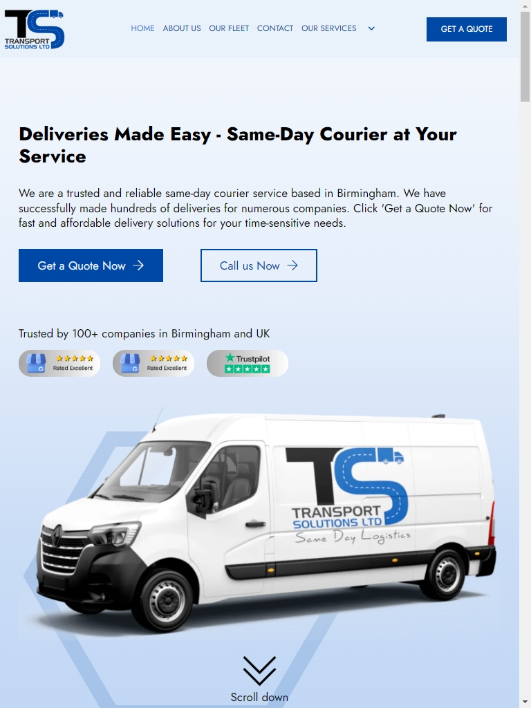
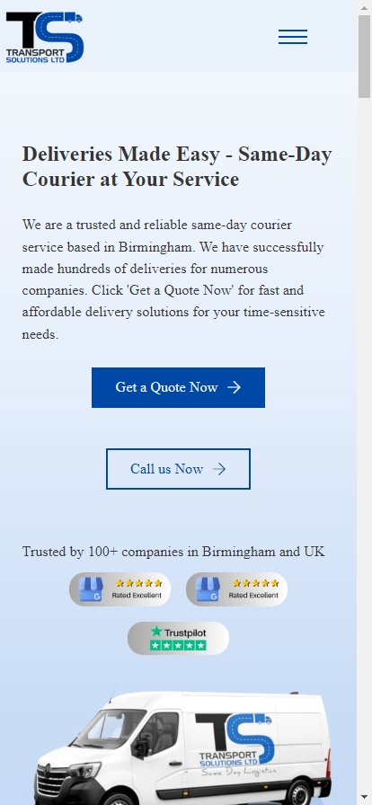

# Portfolio Websites
Here are few of the websites build by me. 

---

## Table of Contents
1. [About Me](#about-me)
2. [Projects](#projects)
   - [MDavid Electrical Services - Wordpress](#project-mdavid-electrical-services)
   - [Healthy Bites Living - Wordpress](#project-healthy-bites-living )
   - [CTC Performance - Shopify](#project-ctc-performance )
   - [TS Transport Solutions - Wordpress](#project-ts-transport-solutions )
3. [Contact](#contact)

---

## About Me

Hi, I’m Jakub Jeziorski—a freelance web developer and tech enthusiast who loves building fast, user-friendly, and SEO-optimized websites. Whether it’s WordPress, Shopify, or custom solutions, I thrive on turning ideas into digital reality.

I’m always exploring the latest in tech and looking for exciting opportunities to grow and contribute.

Interested in my work? Let’s chat! Or, if you’re feeling bold, invite me to an interview for a job 😉.

- **LinkedIn:** [https://www.linkedin.com/in/jjeziorski/](https://www.linkedin.com/in/jjeziorski/)
---

## Projects

### Project: MDavid Electrical Services  
**Website:** [MDavid Electrical Services](https://mdavidelectrician.co.uk)  
**Performance (PageSpeed Insights):** 95/100 Desktop

#### Technology Stack:
- **Platform:** WordPress
- **Tools:** CSS, HTML, JavaScript, Metabox (CPT), Bricks, WS Form, AutomatiCSS, Frames

#### Overview:
The website effectively promotes MDavid Electrical Services, a trusted and top-rated electrical contractor in Oxfordshire. It highlights various services such as solar panel installations, smart home automation, and electrical safety inspections.

#### Key Features:
- Fast load times with a Speed Index of 0.8s.
- Optimized for both desktop and mobile views.
- User-friendly forms for lead generation and inquiries.
- The design and development were both completely done by me.

#### Screenshots:

  
  

---

---

### Project: Healthy Bites Living 
**Website:** [Healthy Bites Living](https://healthybitesliving.com)  
**Performance (PageSpeed Insights):** 96/100 Desktop

#### Technology Stack:
- **Platform:** WordPress
- **Tools:** CSS, HTML, JavaScript, Metabox (CPT), Oxygen, WS Forms, AutomatiCSS, OxyExtra

#### Overview:
Healthy Bites Living offers a healthy meal delivery service across the UK, providing fresh, nutritious, and calorie-controlled meals. Their platform is designed for individuals looking to improve their eating habits and fitness levels, offering a variety of meal plans for different dietary needs. The site includes options to calculate calorie needs, order meals, and learn more about the company's sustainable, eco-friendly approach.

#### Key Features:
- Custom JS script that takes user input and verifes if given postcode is within the delivery zone (list of postcodes). 
- Optimized for both desktop and mobile views.
- Calories Calculator 
- The design and development were both completely done by me.

#### Screenshots:

  
  

---

---

### Project: CTC Performance
**Website:** [CTC Performance](https://ctc-performance.co.uk)  
**Performance (PageSpeed Insights):** 96/100 Desktop

#### Technology Stack:
- **Platform:** Shopify
- **Tools:** HTML, CSS, JavaScript, Metafields, Shopify Apps

#### Overview:
CTC Performance is an e-commerce platform specializing in high-performance automotive parts, particularly for Suzuki Swift models. The site offers a wide range of parts, including intakes, exhausts, suspension kits, and intercoolers, designed to enhance vehicle performance. With detailed product descriptions, competitive pricing, and an intuitive user interface, the platform caters to car enthusiasts seeking quality upgrades for their vehicles.

#### Key Features:
- Successfully migrated from PrestaShop to Shopify, achieving nearly £140,000 in organic revenue within the first year.
- Ensured seamless SEO-friendly migration, including link redirects and Google Search Console updates.
- Developed a faster, fully mobile-responsive site with intuitive navigation, improving user experience significantly.
- Designed for a niche automotive market, catering specifically to Suzuki Swift performance parts enthusiasts, with robust filtering and categorization for models like ZC33S and others.

#### Screenshots:

  
  

---

---

### Project: TS Transport Solutions
**Website:** [TS Transport Solutions](https://ctc-performance.co.uk)  
**Performance (PageSpeed Insights):** 100/100 Desktop

#### Technology Stack:
- **Platform:** WordPress
- **Tools:** Metabox (CPT), Bricks, WS Form, AutomatiCSS, Frames

#### Overview:
This website was created for TS Transport Solutions Ltd, a courier company serving Birmingham and beyond. It provides an intuitive platform for businesses needing reliable delivery solutions. By combining dynamic animations, fast performance, and responsive design, the site effectively communicates the company’s commitment to quality service.

#### Key Features:
- Developed as a brochure website for a courier company offering tailored logistics services across various sectors, including healthcare, automotive, and professional services.
- Integrated custom post types (CPT) for easier management of service categories and content updates.
- Features extensive animations that enhance user engagement while maintaining a 100% Pagespeed Insights score on desktop for seamless browsing.
- Fully mobile-responsive with optimized loading times for excellent user experience.

#### Screenshots:

  
  

---

---

## Contact

If you’re interested in my work or want to collaborate, feel free to reach out:

- **LinkedIn:** [https://www.linkedin.com/in/jjeziorski/](https://www.linkedin.com/in/jjeziorski/)
